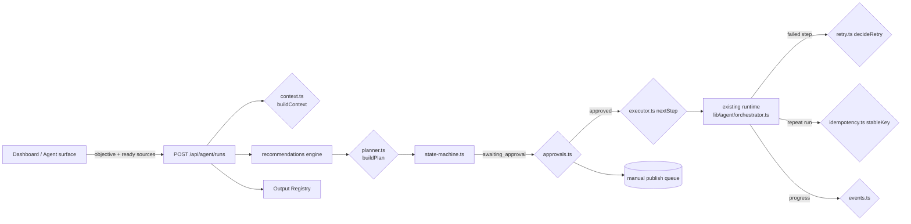
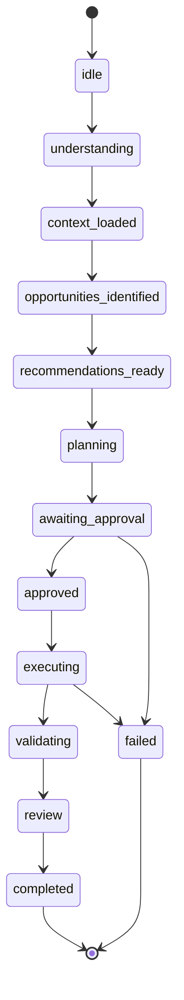

# VervAI Orchestrator v1 — Architecture

**Status:** v1 (coordination policy layer)
**Owners:** Platform / content pipeline

## 1. Purpose

VervAI recommends *what* to create next, then turns that recommendation into a
**reviewable, approved, multi-step plan** and drives it through execution.
The **Orchestrator v1** is the coordination layer that owns the *how*: the run
lifecycle, plan/approval model, executor tick, retry/idempotency policy, and
the error/progress vocabulary.

It deliberately does **not** implement any domain intelligence itself. It is a
thin, deterministic policy shell around the existing subsystems.

## 2. Principles

- **Deterministic.** All policy code is pure (no DB, network, or side effects)
  and unit-tested. The only nondeterminism (backoff jitter) is injectable.
- **Human-gated consequential work.** Publishing is ALWAYS human-initiated.
  Nothing consequential runs without explicit approval.
- **Server-authoritative ownership.** Never trust client-owned references; the
  server resolves and asserts every id before a context is built.
- **Registry is authoritative.** The orchestrator consumes the existing Output
  Registry and recommendation engine; it never forks or re-implements them.
- **Reuse, don't fork.** The durable runtime (`lib/agent/orchestrator.ts`),
  runs/steps persistence, permissions, and retry classification are reused.

## 3. Component diagram

## 4. Lifecycle

`state-machine.ts` is the single source of truth for legal transitions.

Invariants enforced:
- Terminal states (`completed`, `failed`, `cancelled`) never transition.
- `awaiting_approval → executing` is impossible; it must pass through `approved`.
- `paused` may resume to any active, non-terminal state.

## 5. Plan & approval model

`buildPlan` converts ranked recommendations into typed, dependency-ordered
steps. Every kept output gets a `generate` step plus a trailing `review` step
(review depends on its generate step).

Approval is bound to `{runId, planId, planVersion, userId}`:
- `decide(runId, plan, userId, "approved")` produces a version-bound approval.
- `isApprovalValidFor` rejects approvals whose plan id/version/user/run differ.
- `newPlanVersion` bumps the version and resets status to `draft`, invalidating
  any prior approval — so editing an approved plan forces re-approval.

Publishing is **never** a plan auto-step in v1; it stays the manual queue.

## 6. Execution tick

`executor.nextStep(plan, state)` returns the next runnable step id:
- honors `dependsOn` edges;
- refuses to run anything when `plan.approvalRequired && !state.planApproved`;
- is deterministic (planner emits steps in dependency order).

The durable worker executes the step via the existing tool registry/provider
abstraction and reports results via `markStepDone` / `markStepFailed`.

## 7. Retry & idempotency

- `retry.ts` delegates the transient/permanent judgement to the shared
  `isTransientError` (so orchestration agrees with generation), then applies a
  per-step budget and exponential backoff. Permanent errors fail fast.
- `idempotency.ts` derives a stable key from
  `{user, run, objective, sorted sources, output}` — repeated runs dedupe.
  The row-level guarantee is enforced by a partial-unique index on the existing
  steps table (mirrors `lib/ingestion/idempotency.ts`).

## 8. Errors & analytics

- `errors.ts` maps structured codes → user-safe copy. Internal details are
  separated and log-only.
- `events.ts` maps lifecycle status → friendly label + analytics event
  (`lib/analytics/event-names.ts` ORCH_* events).

## 9. What's intentionally out of scope (v1)

- No new dependencies.
- No autonomous generation/publishing.
- No re-implementation of recommendation/intelligence/generation/validation/
  publishing/registry — those stay in their existing modules.

## 10. Suggested feature flag

Expose the execution wiring behind `VERVAI_ORCHESTRATOR_V1` (env flag) so the
policy layer can ship and be tested without altering existing agent behavior
until the full flow is production-safe.
